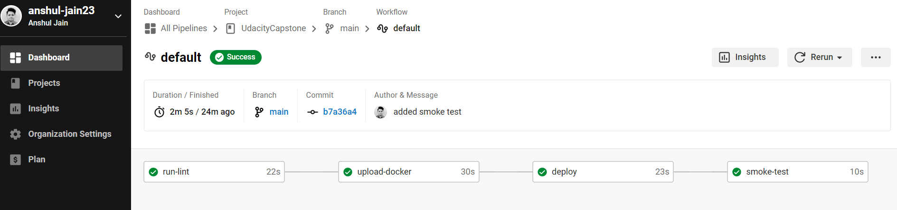

# UdacityCapstone
Capstone Project

# Cloud DevOps Engineer Capstone Project
Capstone project for Cloud DevOps Engineer Nanodegree at Udacity.

# Important URLs
- GitHub Url: https://github.com/anshul-jain23/UdacityCapstone
- Circle CI: https://app.circleci.com/pipelines/github/anshul-jain23/UdacityCapstone
- capstone-app url: [http://ec2-54-81-6-243.compute-1.amazonaws.com:8000](http://af513deeb49284e54a23124526c518e3-1114960449.us-east-1.elb.amazonaws.com/)
- Docker Hub: https://hub.docker.com/repository/docker/anshuljain1706/capstone/general

## Application
The application is a simple Hello Udacity Flask project based on python that display a html page with the text "Hello .. Welcome to the Udacity's Capstone Project". 

## Screenshots
### Stacks

